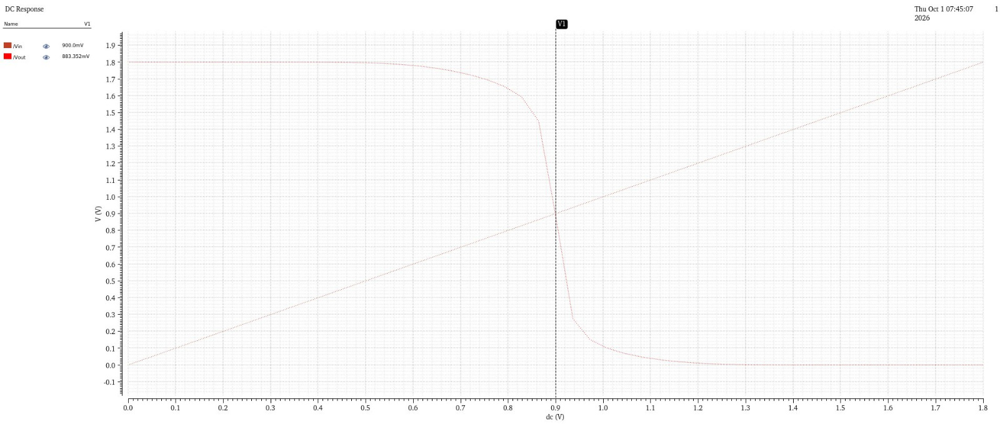

# CMOS Inverter – NOT Gate

## Project Overview

This project demonstrates the design and simulation of a CMOS inverter (NOT gate) using Cadence Virtuoso.

A CMOS inverter is one of the fundamental building blocks of digital integrated circuits. It consists of a PMOS transistor connected to the supply voltage and an NMOS transistor connected to ground.

The circuit performs logical inversion:

- When Vin = LOW, Vout = HIGH
- When Vin = HIGH, Vout = LOW

The inverter was analyzed using DC and transient simulations.

---

## Circuit Description

The CMOS inverter consists of:

- One PMOS transistor
- One NMOS transistor
- VDD = 1.8 V
- Input voltage (Vin)
- Output voltage (Vout)

The gates of the PMOS and NMOS transistors are connected together to form the input.

Their drains are connected together to form the output.

The PMOS source is connected to VDD, while the NMOS source is connected to ground.

---

## Technology and Simulation

| Parameter | Value |
|---|---|
| Circuit | CMOS Inverter |
| Logic Function | NOT |
| Supply Voltage | 1.8 V |
| Simulation Tool | Cadence Virtuoso |
| Analysis | DC and Transient |
| Input Pattern | 1001001 |

---

## DC Analysis

A DC sweep was performed by varying the input voltage from 0 V to 1.8 V.

The resulting voltage-transfer characteristic demonstrates the inversion behavior of the CMOS inverter.

The switching region occurs around the middle of the supply voltage.

The observed operating point was approximately:

**883.23 mV**

At this region, the input and output voltages undergo a rapid transition.

### DC Response



---

## Transient Analysis

A transient simulation was performed using a digital input pattern.

The applied input pattern was:

1001001

Since the circuit performs logical inversion, the corresponding output pattern is:

0110110

The transient response confirms the expected NOT-gate operation.


## Transient Response


Logic Operation

| Vin | Vout |
| :---: | :---: |
| 0 | 1 |
| 1 | 0 |

---

Therefore:

Vout = NOT(Vin)

For the applied input pattern:

Input  = 1001001

Output = 0110110

## Simulation Results

The simulations demonstrate that:

The CMOS inverter performs the expected logical inversion.
The DC analysis produces the expected voltage-transfer characteristic.
The switching region occurs near the middle of the 1.8 V supply range.
The observed switching/operating point is approximately 883.23 mV.
The transient response confirms correct inversion of the applied digital input pattern.

## Tools Used

Cadence Virtuoso
CMOS transistor-level design
DC Analysis
Transient Analysis
Conclusion

---

## Key Learning Outcomes

Through this project, the following concepts were explored:

- CMOS inverter architecture
- PMOS and NMOS transistor operation
- CMOS logic-level inversion
- Voltage Transfer Characteristic (VTC)
- Switching-point analysis
- DC sweep analysis
- Transient analysis
- Digital input pattern verification
- Cadence Virtuoso simulation workflow
- Basic transistor-level digital circuit design

---

## Key Result

The CMOS inverter successfully demonstrated NOT-gate functionality with a 1.8 V supply.

The observed switching/operating point from the DC analysis was:

**VSW ≈ 883.23 mV**

The transient simulation verified the following input-output relationship:

```text
Input  : 1001001
Output : 0110110

```
## Author

Anirban Dey

B.Tech — Electronics & VLSI
Maulana Abul Kalam Azad University of Technology, West Bengal

GitHub:
https://github.com/Anirbandey3641/Digital_design
