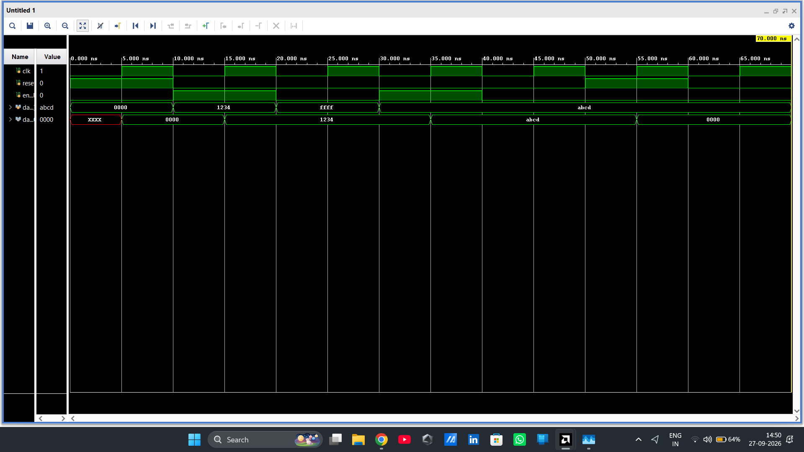
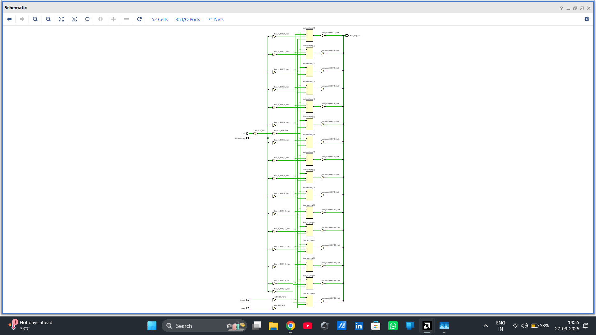

# 16-Bit Register using Verilog HDL

## Overview

This project implements a **16-bit register using Verilog HDL** and verifies its functionality using a testbench in **Xilinx Vivado**.

The register stores 16-bit data and updates its contents on the **positive edge of the clock** when the enable signal is active. It also includes a reset input to clear the stored data.

The project demonstrates the basic operation of a **sequential digital circuit** and provides practical understanding of clocked data storage.

---

## Features

- 16-bit data storage
- Positive-edge triggered operation
- Synchronous reset
- Enable-controlled data loading
- Data hold operation when enable is disabled
- Behavioral simulation using Vivado
- RTL schematic analysis
- Testbench-based verification

---

## Inputs and Outputs

| Signal | Direction | Width | Description |
|---|---|---:|---|
| `clk` | Input | 1-bit | Clock signal |
| `reset` | Input | 1-bit | Clears the register |
| `enable` | Input | 1-bit | Enables data loading |
| `data_in` | Input | 16-bit | Data to be stored |
| `data_out` | Output | 16-bit | Stored register data |

---

## Functional Operation

The register operates according to the following conditions:

| Reset | Enable | Operation |
|:---:|:---:|---|
| 1 | X | Register is cleared to `0000` |
| 0 | 1 | `data_in` is stored on the rising edge of `clk` |
| 0 | 0 | Previous value is retained |

The register changes its stored value only on the **positive edge of the clock**.

---

## Register Operation

The basic operation can be represented as:

```text
                  ┌─────────────────────┐
data_in[15:0] ───►                      │
                  │        16-Bit       │───► data_out[15:0]
clk ─────────────►│        Register     │
reset ───────────►│                     │
enable ──────────►│                     │
                  └─────────────────────┘

```
---
## Simulation Waveform

The simulation waveform confirms that the register correctly stores input data on the rising edge of the clock when `enable` is HIGH.

It also demonstrates that the register retains its previous value when `enable` is LOW and clears its output when reset is activated.

### Simulation Waveform



---

## RTL Schematic

The RTL schematic generated in **Xilinx Vivado** shows the internal implementation of the 16-bit register.

The schematic contains individual storage elements corresponding to the 16 bits of the register, along with the common clock, reset, enable, data input, and data output connections.

The RTL schematic confirms that the design is implemented as a **sequential logic circuit**.

### RTL Schematic



---

## Verification Result

The register was successfully verified through behavioral simulation.

The waveform confirms:

- Reset correctly clears the register.
- Input data is stored when `enable = 1`.
- Stored data changes on the rising edge of the clock.
- Previous data is retained when `enable = 0`.
- The register can store different 16-bit values correctly.

The simulation successfully demonstrates the expected behavior of the 16-bit register.

---

## Project Structure

```text
Register16/
│
├── register.v
├── register_tb.v
├── README.md
│
├── simulation/
│   └──simulation.png
│
└── synthesis/
    └── rtl_schematic.png
```
## Tools Used

- Verilog HDL
- Xilinx Vivado
- Behavioral Simulation
- RTL Schematic
- Testbench Verification

---

## Learning Outcomes

Through this project, the following concepts were implemented and understood:

- Sequential logic design
- Registers
- Clocked data storage
- Positive-edge triggering
- Synchronous reset
- Enable-controlled data loading
- Data hold operation
- Verilog `always` blocks
- Non-blocking assignments
- Behavioral simulation
- RTL schematic analysis
- Testbench development

---

## Applications

Registers are fundamental building blocks in digital systems and are commonly used in:

- Microprocessors
- Microcontrollers
- CPU datapaths
- Digital signal processing systems
- Memory interfaces
- Counters and control units
- FPGA-based digital systems
- Pipelined architectures

---

## Conclusion

This project demonstrates the successful implementation and verification of a **16-bit register using Verilog HDL**.

The register correctly stores 16-bit data on the rising edge of the clock when enabled, retains its previous value when disabled, and clears its contents when reset is activated.

The simulation waveform and RTL schematic generated in Xilinx Vivado verify the expected sequential behavior of the design.

This project provides a practical foundation for understanding **registers, sequential logic, clocked circuits, and data storage**, which are essential concepts in digital design and FPGA development.

---

## Author

**Anirban Dey**

B.Tech — Electronics & VLSI  
Maulana Abul Kalam Azad University of Technology, West Bengal

**GitHub:**  
https://github.com/Anirbandey3641/Digital_design
